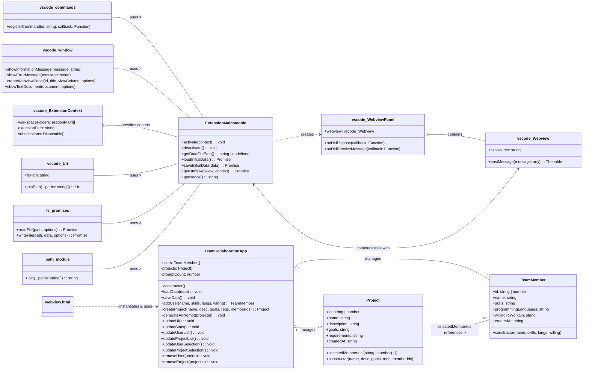

Design Document - Part II API
=============================

## Design Document - Part II: API

### General Review of Software Architecture

As outlined in Design Document - Part I, the AI Collab Agent extension follows a **client-server architecture within the VS Code environment**:

  * **Backend (Extension Host):** This is primarily handled by `extension.ts`. It runs in the VS Code extension host process (Node.js environment).
      * **Responsibilities:** File system interaction (saving/loading data to `.aiCollabData.json`), communication with VS Code API (showing messages, opening new editor tabs), generating AI prompts, and handling messages from the Webview.
      * **Data Persistence:** Manages the persistent storage of `TeamMember` and `Project` data.
  * **Frontend (Webview):** This is handled by `webview.html` (and its embedded JavaScript and CSS). It runs in a separate, sandboxed browser environment within VS Code.
      * **Responsibilities:** User Interface rendering (forms, lists, status messages), user input handling, local state management (though data persistence is delegated to the backend), and sending messages to the `extension.ts` backend via the `vscode` API.
      * **Communication:** Interacts with `extension.ts` via message passing (`vscode.postMessage` and `window.addEventListener('message')`).

**Class Diagram Reference:**

Below is a simplified class diagram to illustrate the relationships and responsibilities.

-----

### Module: `extension.ts` (Backend Logic)

This file contains the core logic that runs within the VS Code extension host.

#### Class: `(Implicit) Extension Main Module`

  * **Purpose:** Manages the lifecycle of the VS Code extension, registers commands, initializes the webview, handles inter-process communication with the webview, and manages persistent data storage.

#### Data Fields: (Global/Module-level)

  * `context: vscode.ExtensionContext`
      * **Purpose:** Provides access to the VS Code API and resources relevant to the extension's lifecycle, such as its installation path (`extensionPath`) and global state.

#### Methods:

  * `getDataFilePath(): string | undefined`

      * **Purpose:** Determines the absolute path where the extension's persistent data (`.aiCollabData.json`) should be stored within the currently open VS Code workspace.
      * **Pre-conditions:** A VS Code workspace must be open.
      * **Post-conditions:** Returns a valid file path string if a workspace is open, otherwise `undefined`.
      * **Parameters:** None
      * **Return:** `string | undefined` - The full path to the data file.
      * **Exceptions:** None explicitly thrown, but returns `undefined` if conditions aren't met.

  * `loadInitialData(): Promise<any>`

      * **Purpose:** Asynchronously reads the JSON data from the `.aiCollabData.json` file, parses it, and returns the application's current state (users, projects, prompt count). Provides default empty states if the file doesn't exist or is corrupted.
      * **Pre-conditions:** None. Relies on `getDataFilePath`.
      * **Post-conditions:** Returns a data object containing `users`, `projects`, and `promptCount`. `selectedMemberIds` in projects are guaranteed to be arrays.
      * **Parameters:** None
      * **Return:** `Promise<any>` - A promise that resolves to an object `{ users: [], projects: [], promptCount: 0 }`.
      * **Exceptions:** Handles file read/parse errors internally, falling back to default data.

  * `saveInitialData(data: any): Promise<void>`

      * **Purpose:** Asynchronously serializes the current application data (users, projects, prompt count) into a JSON string and writes it to the `.aiCollabData.json` file.
      * **Pre-conditions:** `data` must be a valid JavaScript object. A workspace must be open to determine the file path.
      * **Post-conditions:** The `data` object is written to the `.aiCollabData.json` file.
      * **Parameters:**
          * `data: any`: The application state object (containing `users`, `projects`, `promptCount`) to be saved.
      * **Return:** `Promise<void>` - A promise that resolves when the data is successfully saved.
      * **Exceptions:** Catches and logs file write errors, shows an error message to the user.

  * `activate(context: vscode.ExtensionContext): void`

      * **Purpose:** The entry point for the VS Code extension. Called when the extension is activated. It registers commands and initializes listeners.
      * **Pre-conditions:** None (called by VS Code).
      * **Post-conditions:** Commands (`aiCollab.debugHello`, `aiCollab.openPanel`) are registered.
      * **Parameters:**
          * `context: vscode.ExtensionContext`: The context provided by VS Code for managing extension resources.
      * **Return:** `void`
      * **Exceptions:** None explicitly.

  * `deactivate(): void`

      * **Purpose:** Called when the extension is deactivated. Used for cleanup. (Currently empty, as VS Code handles most resource disposal for this simple extension).
      * **Pre-conditions:** Extension is active.
      * **Post-conditions:** Resources cleaned up (if any).
      * **Parameters:** None
      * **Return:** `void`
      * **Exceptions:** None explicitly.

  * `getHtml(webview: vscode.Webview, context: vscode.ExtensionContext): Promise<string>`

      * **Purpose:** Reads the content of `webview.html` from the `media` folder, injects a Content Security Policy (CSP) meta tag with a unique `nonce`, and ensures script execution. This prepares the HTML for display in the webview panel.
      * **Pre-conditions:** `media/webview.html` must exist.
      * **Post-conditions:** Returns the modified HTML string ready for the webview.
      * **Parameters:**
          * `webview: vscode.Webview`: The webview instance, used to get `cspSource`.
          * `context: vscode.ExtensionContext`: The extension context, used to get `extensionPath`.
      * **Return:** `Promise<string>` - A promise that resolves to the full HTML content with CSP injected.
      * **Exceptions:** Catches file read errors (though not explicitly handled, an error would propagate).

  * `getNonce(): string`

      * **Purpose:** Generates a cryptographically random string (nonce) used for the Content Security Policy to allow specific scripts to run while disallowing others.
      * **Pre-conditions:** None.
      * **Post-conditions:** Returns a 32-character alphanumeric string.
      * **Parameters:** None
      * **Return:** `string` - A random nonce string.
      * **Exceptions:** None.

-----

### Module: `webview.html` (Frontend Logic)

This file contains the HTML, CSS, and JavaScript that renders and manages the user interface within the VS Code webview panel.

#### Class: `TeamMember`

  * **Purpose:** Represents a single team member with their profile details. Used to create, display, and manage individuals in the application.

#### Data Fields:

  * `id: string | number`
      * **Purpose:** Unique identifier for the team member. (Generated using `Date.now() + Math.random()`).
  * `name: string`
      * **Purpose:** The full name of the team member.
  * `skills: string`
      * **Purpose:** A comma-separated list of skills the member possesses.
  * `programmingLanguages: string`
      * **Purpose:** A comma-separated list of programming languages the member knows.
  * `willingToWorkOn: string`
      * **Purpose:** Description of the member's interests or preferred project types.
  * `createdAt: string`
      * **Purpose:** Timestamp (ISO string) of when the team member was added.

#### Methods:

  * `constructor(name: string, skills: string, programmingLanguages: string, willingToWorkOn: string)`
      * **Purpose:** Initializes a new `TeamMember` object.
      * **Pre-conditions:** `name`, `skills`, `programmingLanguages` should ideally be non-empty strings.
      * **Post-conditions:** A `TeamMember` instance with generated `id` and `createdAt` is created.
      * **Parameters:**
          * `name: string`: Full name.
          * `skills: string`: Comma-separated skills.
          * `programmingLanguages: string`: Comma-separated languages.
          * `willingToWorkOn: string`: Interests/preferences.
      * **Return:** `TeamMember` instance.
      * **Exceptions:** None.

#### Class: `Project`

  * **Purpose:** Represents a single project within the application, encompassing its details and associated team members.

#### Data Fields:

  * `id: string | number`
      * **Purpose:** Unique identifier for the project.
  * `name: string`
      * **Purpose:** The name of the project.
  * `description: string`
      * **Purpose:** A detailed description of the project.
  * `goals: string`
      * **Purpose:** The objectives or aims of the project.
  * `requirements: string`
      * **Purpose:** Technical and functional requirements of the project.
  * `selectedMemberIds: (string | number)[]`
      * **Purpose:** An array of `id`s of the `TeamMember`s assigned to this project.
  * `createdAt: string`
      * **Purpose:** Timestamp (ISO string) of when the project was created.

#### Methods:

  * `constructor(name: string, description: string, goals: string, requirements: string, selectedMemberIds: (string | number)[])`
      * **Purpose:** Initializes a new `Project` object.
      * **Pre-conditions:** `name`, `description` should ideally be non-empty strings. `selectedMemberIds` should be an array of valid `TeamMember` IDs.
      * **Post-conditions:** A `Project` instance with generated `id` and `createdAt` is created.
      * **Parameters:**
          * `name: string`: Project name.
          * `description: string`: Project description.
          * `goals: string`: Project goals.
          * `requirements: string`: Project requirements.
          * `selectedMemberIds: (string | number)[]`: Array of IDs of assigned team members.
      * **Return:** `Project` instance.
      * **Exceptions:** None.

#### Class: `TeamCollaborationApp`

  * **Purpose:** The central controller for the webview's UI and data management. It orchestrates user interactions, updates the display, and communicates with the VS Code extension backend for data persistence and AI services.

#### Data Fields:

  * `users: TeamMember[]`
      * **Purpose:** An array holding all `TeamMember` objects currently loaded in the application.
  * `projects: Project[]`
      * **Purpose:** An array holding all `Project` objects currently loaded in the application.
  * `promptCount: number`
      * **Purpose:** A counter for how many AI prompts have been generated.

#### Methods:

  * `constructor()`

      * **Purpose:** Initializes the application state and immediately requests initial data from the VS Code extension.
      * **Pre-conditions:** None.
      * **Post-conditions:** `users`, `projects` are initialized as empty arrays, `promptCount` to 0. A message is sent to the extension to `loadData`.
      * **Parameters:** None
      * **Return:** `TeamCollaborationApp` instance.
      * **Exceptions:** None.

  * `loadData(data: { users: any[], projects: any[], promptCount: number }): void`

      * **Purpose:** Updates the internal state of the `TeamCollaborationApp` with data received from the VS Code extension. It reconstructs `TeamMember` and `Project` objects from raw data and then triggers a UI update.
      * **Pre-conditions:** `data` must be an object containing `users`, `projects`, and `promptCount`.
      * **Post-conditions:** `this.users`, `this.projects`, `this.promptCount` are updated. The UI is re-rendered.
      * **Parameters:**
          * `data: object`: The payload received from the extension, containing arrays of user and project data and the prompt count.
      * **Return:** `void`
      * **Exceptions:** None.

  * `saveData(): void`

      * **Purpose:** Sends the current internal state (`this.users`, `this.projects`, `this.promptCount`) to the VS Code extension for persistent storage.
      * **Pre-conditions:** None.
      * **Post-conditions:** A `saveData` message is posted to the VS Code extension.
      * **Parameters:** None
      * **Return:** `void`
      * **Exceptions:** None.

  * `addUser(name: string, skills: string, programmingLanguages: string, willingToWorkOn: string): TeamMember`

      * **Purpose:** Creates a new `TeamMember` object, adds it to the `users` array, and triggers data saving and UI update.
      * **Pre-conditions:** `name`, `skills`, `programmingLanguages` must be non-empty strings.
      * **Post-conditions:** A new `TeamMember` is added, data is saved, UI is updated.
      * **Parameters:**
          * `name: string`: Full name.
          * `skills: string`: Comma-separated skills.
          * `programmingLanguages: string`: Comma-separated languages.
          * `willingToWorkOn: string`: Interests/preferences.
      * **Return:** `TeamMember` - The newly added user object.
      * **Exceptions:** Throws `Error` if required fields are empty.

  * `createProject(name: string, description: string, goals: string, requirements: string, selectedUserIds: (string|number)[]): Project`

      * **Purpose:** Creates a new `Project` object with assigned team members, adds it to the `projects` array, and triggers data saving and UI update.
      * **Pre-conditions:** `name`, `description` must be non-empty strings. `selectedUserIds` must be a non-empty array of existing user IDs.
      * **Post-conditions:** A new `Project` is added, data is saved, UI is updated.
      * **Parameters:**
          * `name: string`: Project name.
          * `description: string`: Project description.
          * `goals: string`: Project goals.
          * `requirements: string`: Project requirements.
          * `selectedUserIds: (string|number)[]`: Array of IDs of selected team members.
      * **Return:** `Project` - The newly created project object.
      * **Exceptions:** Throws `Error` if required fields are empty or no members are selected.

  * `generateAIPrompt(projectId: string | number): void`

      * **Purpose:** Requests the VS Code extension backend to generate an AI prompt for a specified project.
      * **Pre-conditions:** `projectId` must be a valid ID of an existing project.
      * **Post-conditions:** A `generatePrompt` message is posted to the VS Code extension. The UI displays a "Generating..." status.
      * **Parameters:**
          * `projectId: string | number`: The ID of the project for which to generate the prompt.
      * **Return:** `void`
      * **Exceptions:** None (error handling for invalid project ID is on the extension side).

  * `updateUI(): void`

      * **Purpose:** A central method to refresh all parts of the webview UI (stats, user list, project list, dropdowns) based on the current internal data.
      * **Pre-conditions:** None.
      * **Post-conditions:** All relevant UI elements are updated.
      * **Parameters:** None
      * **Return:** `void`
      * **Exceptions:** None.

  * `updateStats(): void`

      * **Purpose:** Updates the display of the total number of users, projects, and AI prompts.
      * **Pre-conditions:** None.
      * **Post-conditions:** The `userCount`, `projectCount`, and `promptCount` elements in the HTML are updated.
      * **Parameters:** None
      * **Return:** `void`
      * **Exceptions:** None.

  * `updateUserList(): void`

      * **Purpose:** Renders or re-renders the list of all team members in the "Team Members" tab.
      * **Pre-conditions:** The `userList` HTML element must exist.
      * **Post-conditions:** The `userList` element contains HTML representations of all `this.users`.
      * **Parameters:** None
      * **Return:** `void`
      * **Exceptions:** None.

  * `updateProjectList(): void`

      * **Purpose:** Renders or re-renders the list of all projects in the "Projects" tab, showing assigned team members.
      * **Pre-conditions:** The `projectList` HTML element must exist.
      * **Post-conditions:** The `projectList` element contains HTML representations of all `this.projects`.
      * **Parameters:** None
      * **Return:** `void`
      * **Exceptions:** None.

  * `updateUserSelection(): void`

      * **Purpose:** Populates the multi-select checkbox list for team member assignment when creating a project.
      * **Pre-conditions:** The `userSelection` HTML element must exist.
      * **Post-conditions:** The `userSelection` element contains checkbox inputs for all `this.users`.
      * **Parameters:** None
      * **Return:** `void`
      * **Exceptions:** None.

  * `updateProjectSelection(): void`

      * **Purpose:** Populates the dropdown list of projects in the "AI Prompts" tab for prompt generation.
      * **Pre-conditions:** The `promptProject` HTML select element must exist.
      * **Post-conditions:** The `promptProject` element contains `<option>` tags for all `this.projects`.
      * **Parameters:** None
      * **Return:** `void`
      * **Exceptions:** None.

  * `removeUser(userId: string | number): void`

      * **Purpose:** Removes a `TeamMember` from the `users` array by their ID. Also removes this user from any projects they were assigned to. Triggers data saving and UI update.
      * **Pre-conditions:** `userId` must correspond to an existing `TeamMember`.
      * **Post-conditions:** The specified user is removed from `this.users` and from `selectedMemberIds` of any project. Data is saved, UI is updated.
      * **Parameters:**
          * `userId: string | number`: The ID of the user to remove.
      * **Return:** `void`
      * **Exceptions:** None.

  * `removeProject(projectId: string | number): void`

      * **Purpose:** Removes a `Project` from the `projects` array by its ID. Triggers data saving and UI update.
      * **Pre-conditions:** `projectId` must correspond to an existing `Project`.
      * **Post-conditions:** The specified project is removed from `this.projects`. Data is saved, UI is updated.
      * **Parameters:**
          * `projectId: string | number`: The ID of the project to remove.
      * **Return:** `void`
      * **Exceptions:** None.

-----

### Additional Notes:

  * **Error Handling:** Exceptions are primarily handled at the point of origin (e.g., `addUser` throws an `Error` for missing fields, which is then caught by the event listener and displayed via `showStatus`). Network/file errors are handled on the extension side.
  * **Parameters & Data Types:** TypeScript-like annotations (`: string`, `: number`, `: any[]`, `: Promise<void>`) are used to indicate data types.
  * **Documentation Generation:** Tools like JSDoc (for JavaScript/TypeScript) can parse comments structured like the ones described here (e.g., using `@param`, `@returns`, `@throws`) to automatically generate HTML documentation. This document serves as the *content* that would typically go into those comments.

-----

### Module: `ai-analyze-code.ts` (AI Code Analyzer)

This file implements the "AI Analyze Code" feature of the VS Code extension. It is integrated with the Supabase backend to analyze the user highlighted code with the OpenAI API. It displays inline UI buttons via CodeLens, and AI feedbback in a side panel.

#### Class: `AnalyzeCodeLensProvider`

  * **Purpose:** Provides and manages dynamic entries (inline buttons) in the editor when the user highlights a block of code eligible for AI analysis.

