# Sequence Diagrams
<!--

## Use Case 1: Team Creation & Join Workflow

-->

# Create Team & Define Problem

This diagram illustrates the sequence of interactions required to fulfill the "Create Team & Define Problem" use case. The process begins when a User (acting as a student) initiates the "Open 'New Team'" action within the VS Code Extension.

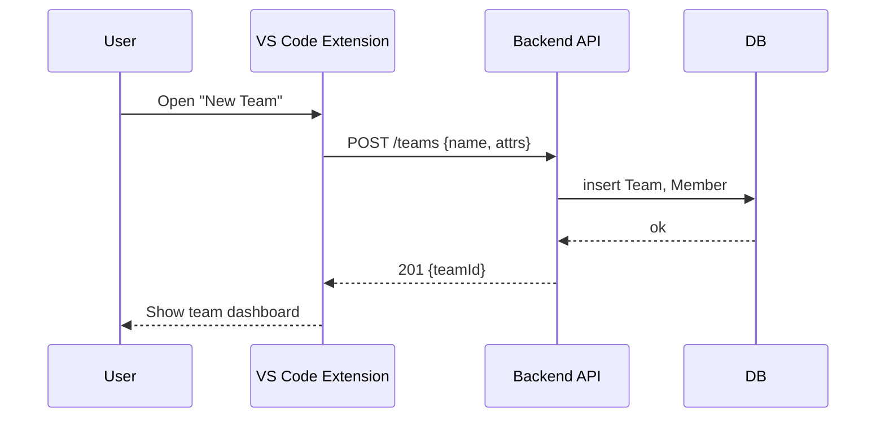
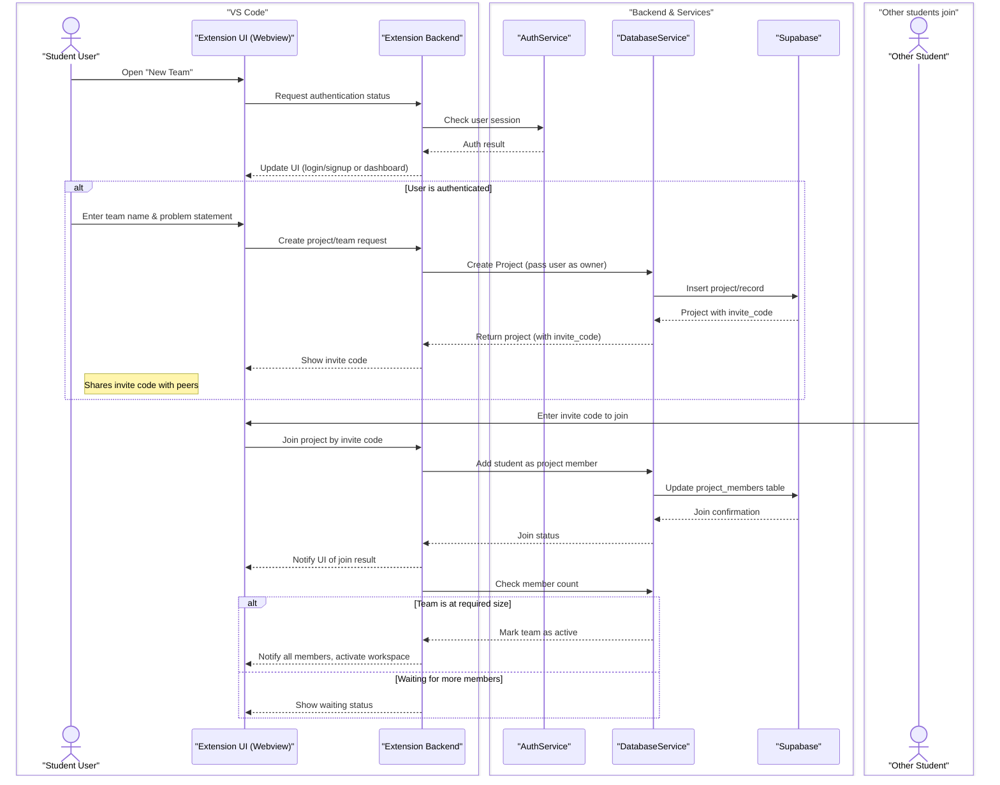
***

# Define Project Specifications

This diagram illustrates the flow of actions involved when a user defines project specifications within the Collaborative Agent system. This activity is a crucial part of the "Create Team & Define Problem" use case, or a subsequent step in project setup.

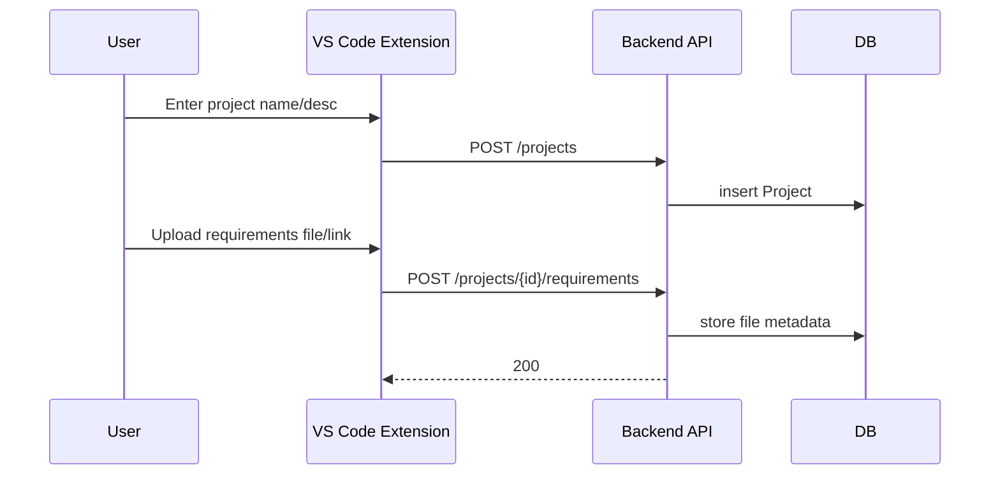
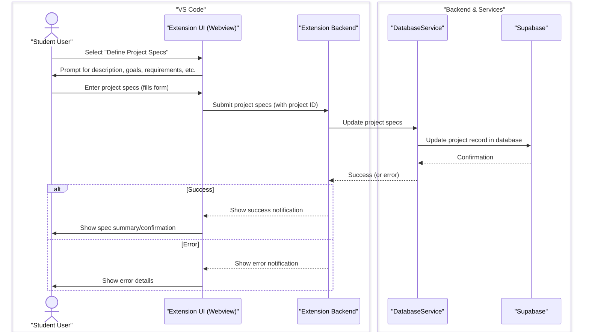
***

# Allocate Tasks to Members (Agent Delegation)

This diagram illustrates the process where the AI Agent automatically delegates coding tasks among team members, corresponding to your "Allocate Tasks to Members" use case.

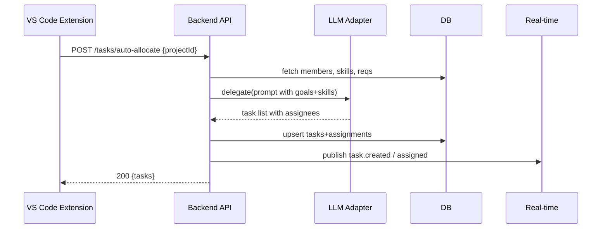
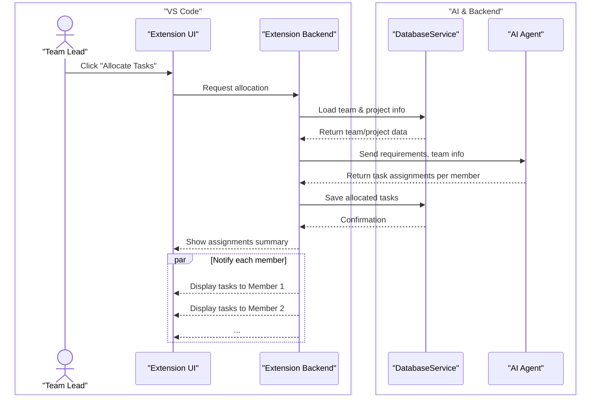
***

# Real-time Status Updates

This diagram illustrates how real-time status updates are communicated between team members, a key aspect of several use cases, including "Allocate Tasks to Members" and "Simultaneous Coding Session."

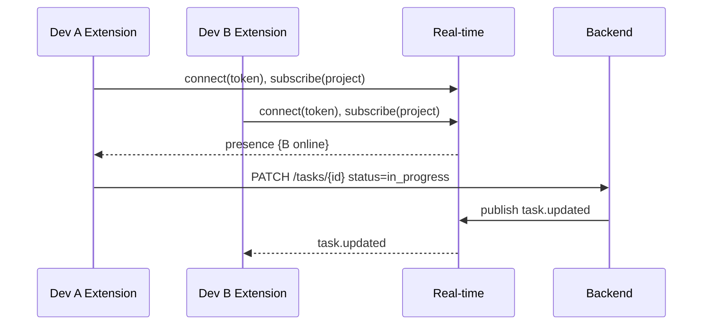
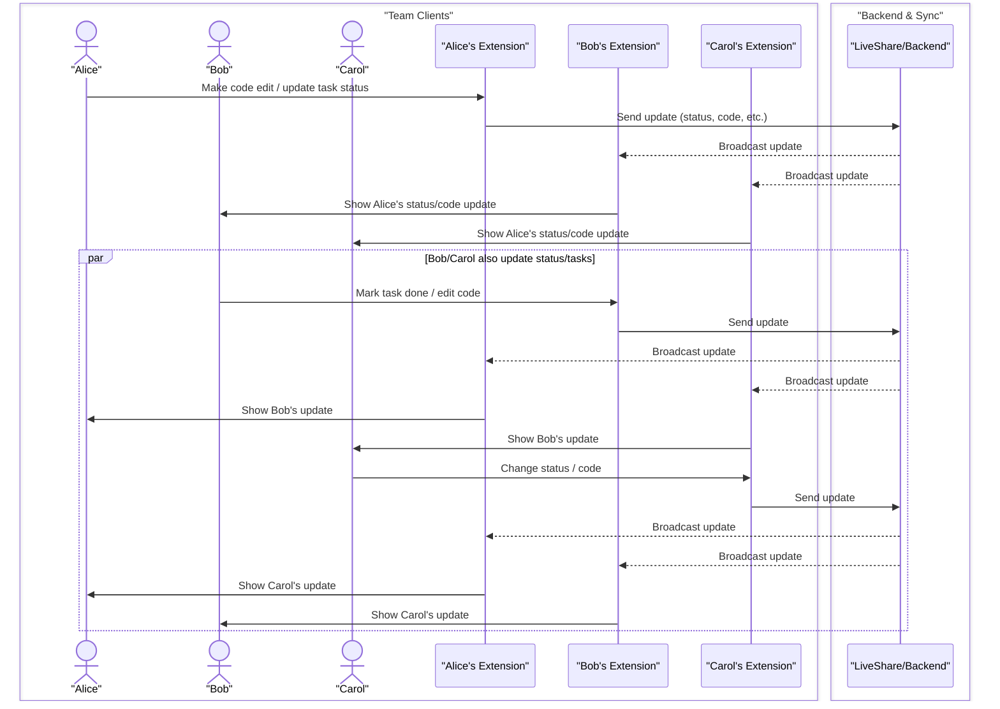
    Note over ExtA,ExtB,ExtC: Status/coding updates appear in all team members' UIs in real time.
***

# Request Peer Review of Code

This diagram illustrates the process for initiating a peer code review. The flow begins when a Dev (Developer), through the VS Code Extension, issues a "Request review on PR" action. This could involve selecting a specific code change, file, or branch to be reviewed.

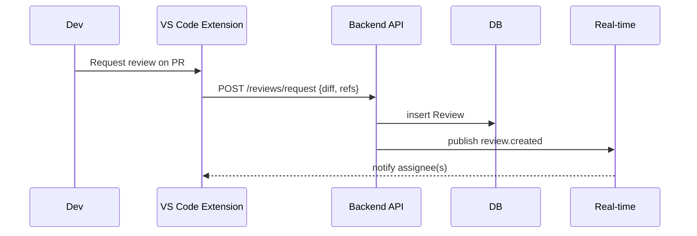
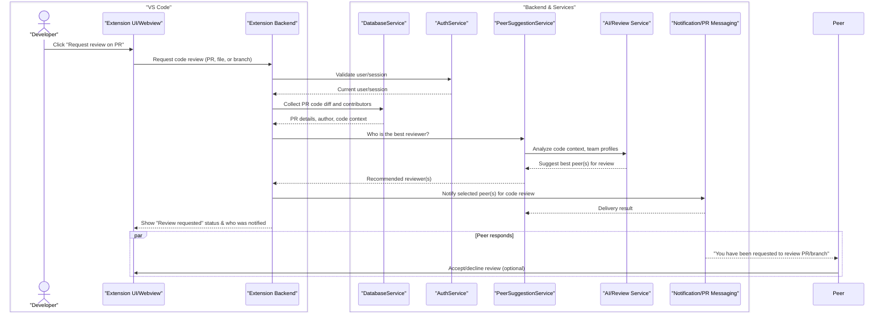
    Note over Webview, Peer: The review request is tracked and UI updates with review status.
***

# Agent Provides Real-Time Feedback

This diagram illustrates the process where the AI agent provides instant, real-time feedback and suggestions to a student while they are coding, directly addressing your "Agent Provides Real-Time Feedback" use case.

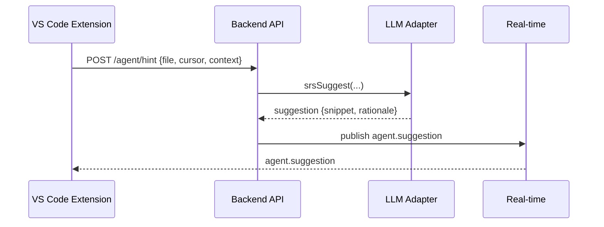
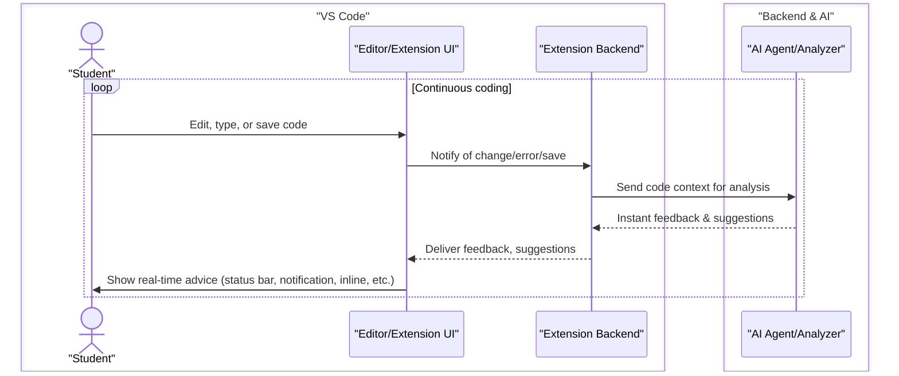
***

# Agent Suggests Improvements Based on Peer Review

This diagram illustrates how the AI agent processes peer review feedback and generates actionable suggestions for the code author, directly addressing your "Agent Suggests Improvements Based on Peer Review" use case.

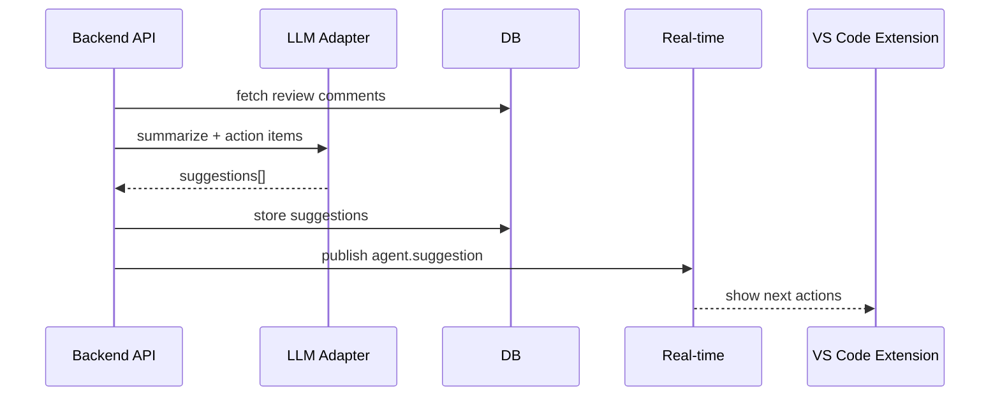
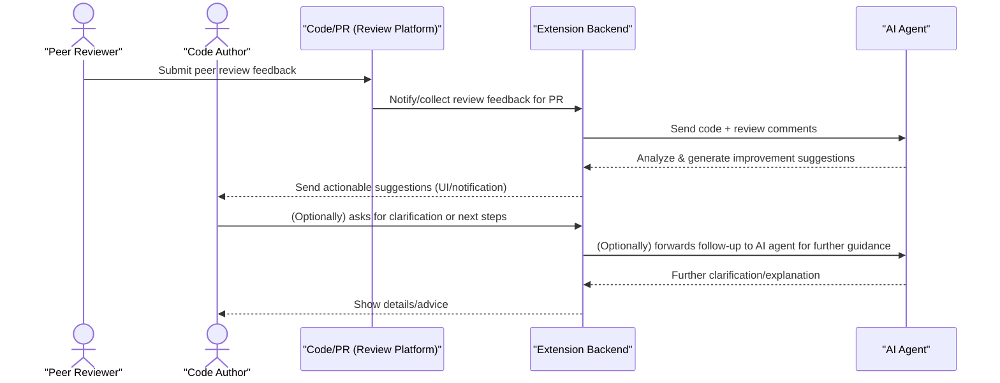
***

# Finalize and Submit Project Work

This diagram illustrates the process for a team to finalize and submit their project, directly addressing your "Finalize and Submit Project Work" use case.

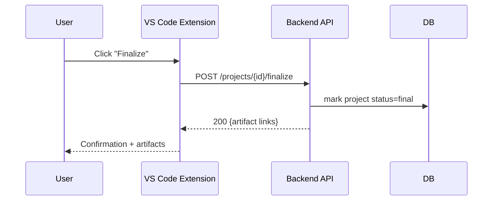
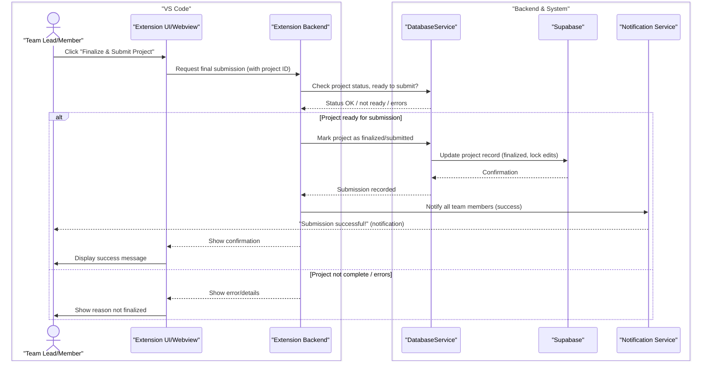

***
